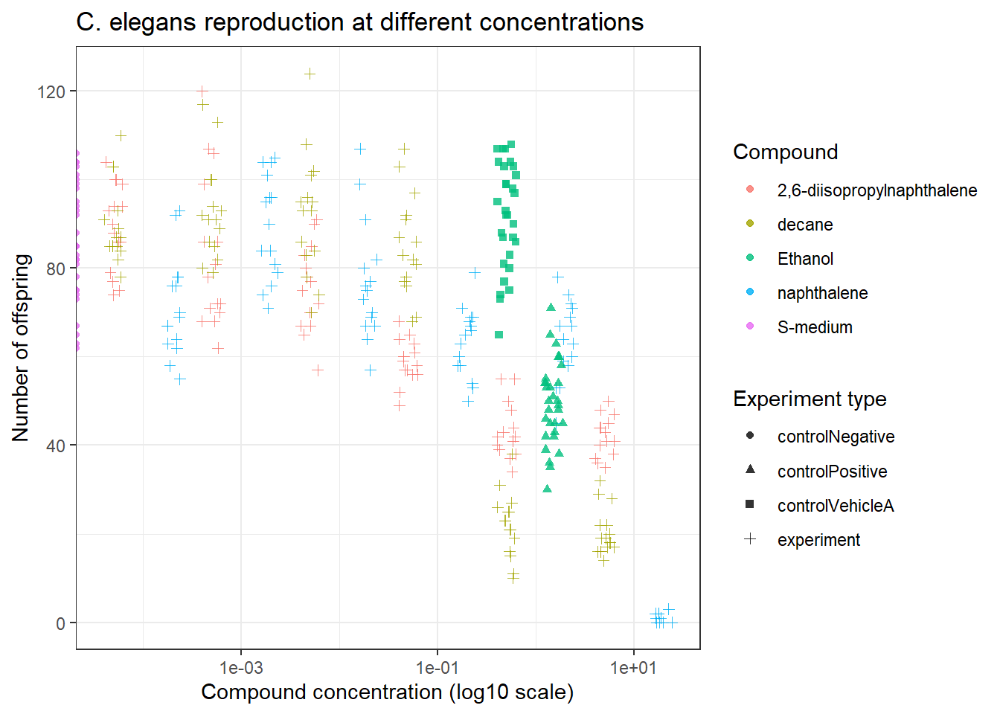
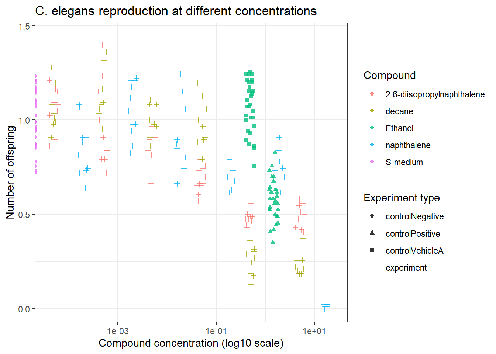
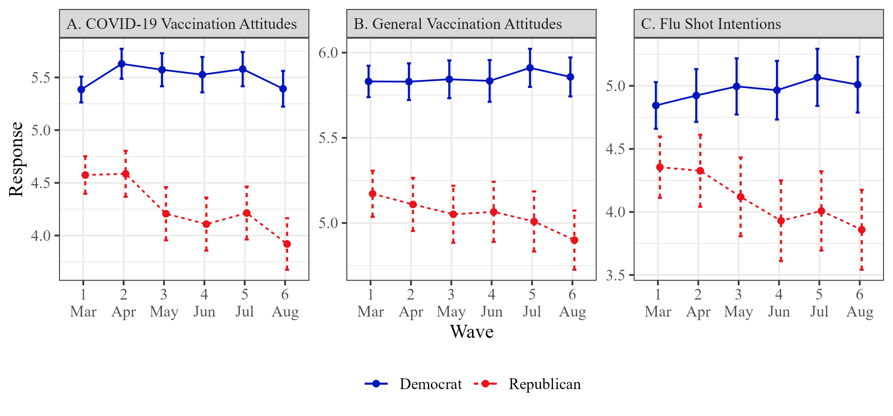

# Reproducible Science

## Reproduction of external data analysis


``` r
# Create data object
data <- read_excel("exercise_4a/data_raw/CE.LIQ.FLOW.062_Tidydata.xlsx")

# Show the first lines of the data
head(data)
```

```
## # A tibble: 6 × 34
##   plateRow plateColumn vialNr dropCode expType    expReplicate expName        
##   <lgl>    <lgl>        <dbl> <chr>    <chr>             <dbl> <chr>          
## 1 NA       NA               1 a        experiment            3 CE.LIQ.FLOW.062
## 2 NA       NA               1 b        experiment            3 CE.LIQ.FLOW.062
## 3 NA       NA               1 c        experiment            3 CE.LIQ.FLOW.062
## 4 NA       NA               1 d        experiment            3 CE.LIQ.FLOW.062
## 5 NA       NA               1 e        experiment            3 CE.LIQ.FLOW.062
## 6 NA       NA               2 a        experiment            3 CE.LIQ.FLOW.062
## # ℹ 27 more variables: expDate <dttm>, expResearcher <chr>, expTime <dbl>,
## #   expUnit <chr>, expVolumeCounted <dbl>, RawData <dbl>, compCASRN <chr>,
## #   compName <chr>, compConcentration <chr>, compUnit <chr>,
## #   compDelivery <chr>, compVehicle <chr>, elegansStrain <chr>,
## #   elegansInput <dbl>, bacterialStrain <chr>, bacterialTreatment <chr>,
## #   bacterialOD600 <dbl>, bacterialConcX <dbl>, bacterialVolume <dbl>,
## #   bacterialVolUnit <chr>, incubationVial <chr>, incubationVolume <dbl>, …
```

``` r
# Check the structure of the data
str(data)
```

```
## tibble [360 × 34] (S3: tbl_df/tbl/data.frame)
##  $ plateRow           : logi [1:360] NA NA NA NA NA NA ...
##  $ plateColumn        : logi [1:360] NA NA NA NA NA NA ...
##  $ vialNr             : num [1:360] 1 1 1 1 1 2 2 2 2 2 ...
##  $ dropCode           : chr [1:360] "a" "b" "c" "d" ...
##  $ expType            : chr [1:360] "experiment" "experiment" "experiment" "experiment" ...
##  $ expReplicate       : num [1:360] 3 3 3 3 3 3 3 3 3 3 ...
##  $ expName            : chr [1:360] "CE.LIQ.FLOW.062" "CE.LIQ.FLOW.062" "CE.LIQ.FLOW.062" "CE.LIQ.FLOW.062" ...
##  $ expDate            : POSIXct[1:360], format: "2020-11-30" "2020-11-30" ...
##  $ expResearcher      : chr [1:360] "Sergio Reijnders - Ellis Herder" "Sergio Reijnders - Ellis Herder" "Sergio Reijnders - Ellis Herder" "Sergio Reijnders - Ellis Herder" ...
##  $ expTime            : num [1:360] 68 68 68 68 68 68 68 68 68 68 ...
##  $ expUnit            : chr [1:360] "hour" "hour" "hour" "hour" ...
##  $ expVolumeCounted   : num [1:360] 50 50 50 50 50 50 50 50 50 50 ...
##  $ RawData            : num [1:360] 44 37 45 47 41 35 41 36 40 38 ...
##  $ compCASRN          : chr [1:360] "24157-81-1" "24157-81-1" "24157-81-1" "24157-81-1" ...
##  $ compName           : chr [1:360] "2,6-diisopropylnaphthalene" "2,6-diisopropylnaphthalene" "2,6-diisopropylnaphthalene" "2,6-diisopropylnaphthalene" ...
##  $ compConcentration  : chr [1:360] "4.99" "4.99" "4.99" "4.99" ...
##  $ compUnit           : chr [1:360] "nM" "nM" "nM" "nM" ...
##  $ compDelivery       : chr [1:360] "Liquid" "Liquid" "Liquid" "Liquid" ...
##  $ compVehicle        : chr [1:360] "controlVehicleA" "controlVehicleA" "controlVehicleA" "controlVehicleA" ...
##  $ elegansStrain      : chr [1:360] "N2" "N2" "N2" "N2" ...
##  $ elegansInput       : num [1:360] 25 25 25 25 25 25 25 25 25 25 ...
##  $ bacterialStrain    : chr [1:360] "OP50" "OP50" "OP50" "OP50" ...
##  $ bacterialTreatment : chr [1:360] "heated" "heated" "heated" "heated" ...
##  $ bacterialOD600     : num [1:360] 0.743 0.743 0.743 0.743 0.743 0.743 0.743 0.743 0.743 0.743 ...
##  $ bacterialConcX     : num [1:360] 8 8 8 8 8 8 8 8 8 8 ...
##  $ bacterialVolume    : num [1:360] 300 300 300 300 300 300 300 300 300 300 ...
##  $ bacterialVolUnit   : chr [1:360] "ul" "ul" "ul" "ul" ...
##  $ incubationVial     : chr [1:360] "1,5 glass vial" "1,5 glass vial" "1,5 glass vial" "1,5 glass vial" ...
##  $ incubationVolume   : num [1:360] 1000 1000 1000 1000 1000 1000 1000 1000 1000 1000 ...
##  $ incubationUnit     : chr [1:360] "ul" "ul" "ul" "ul" ...
##  $ incubationMethod   : chr [1:360] "rockroll" "rockroll" "rockroll" "rockroll" ...
##  $ incubationRPM      : num [1:360] 35 35 35 35 35 35 35 35 35 35 ...
##  $ bubble             : logi [1:360] NA NA NA NA NA NA ...
##  $ incubateTemperature: num [1:360] 20 20 20 20 20 20 20 20 20 20 ...
```

`rawData` is `num`. Dit is goed.  
`compName` is `chr`. Dit is prima, maar `fct` is fijner voor plots.  
`compConcentration` is `chr`. Dit is NIET goed. Dit moet `num` worden.  
`expType` is `chr`. Dit is prima, maar `fct` is fijner voor plots.  


``` r
# Replace ',' by '.' to prevent NA values.
data$compConcentration <- str_replace_all(data$compConcentration, ",", ".")

# Change data types of raw data file
data <- data %>%
  mutate(
    compName = as.factor(compName),
    compConcentration = as.numeric(compConcentration),
    expType = as.factor(expType)
  )
```


``` r
# Create a scatter plot of the data
ggplot(data, aes(x = compConcentration, y = RawData, color = compName, shape = expType)) +
  geom_jitter(width = 0.1, height = 0, size = 1.5, alpha = 0.8) +
  scale_x_log10() +
  theme_bw() +
  labs(
    title = "C. elegans reproduction at different concentrations",
    x = "Compound concentration (log10 scale)",
    y = "Number of offspring",
    color = "Compound",
    shape = "Experiment type"
  )
```




``` r
# Change the mean of the negative control values to 1, followed by changing the other values to fractions of that mean (=1)
negative_control_mean <- mean(data$RawData[data$expType == "controlNegative"], na.rm = TRUE)
data$normalized <- data$RawData / negative_control_mean


# Create a scatter plot of the normalized data
ggplot(data, aes(x = compConcentration, y = normalized, color = compName, shape = expType)) +
  geom_jitter(width = 0.1, height = 0, size = 1.5, alpha = 0.8) +
  scale_x_log10() +
  theme_bw() +
  labs(
    title = "C. elegans reproduction at different concentrations",
    x = "Compound concentration (log10 scale)",
    y = "Number of offspring",
    color = "Compound",
    shape = "Experiment type"
  )
```



**Analysis summary**  
The data were successfully imported and cleaned for analysis. `RawData` was already `numeric`, while `compConcentration` needed to be converted from `character` to `numeric` so that the x-axis could be displayed correctly on a log10 scale. The scatter plots show how reproduction changes across compounds and concentrations, and normalization to the negative control makes the relative effects easier to interpret.

<br>

**Guide for used controls**  
Negative control: the baseline condition without an active compound (0% conc.); used to define normal response (`S-medium`).  
Positive control: a condition known to produce a clear (toxic) effect; used to show that the assay can detect a response (`compConcentration` = 1.5% `ethanol`).  
Vehicle control: a control containing only the solvent or carrier used to dissolve the compound; used to check whether the solvent itself affects the outcome.  
Normalizing to the negative control makes the biological effect of the compounds easier to interpret, because it becomes clear how much reproduction remains compared with normal conditions:  

-	1 means no effect.
-	less than 1 means decreased reproduction.
-	greater than 1 means increased reproduction.

<br>

**Workflow for further research**

1.	Installing and loading the drc package.
2.	Import the data into R.
3.	Clean and inspect the variables.
4.	Filter the dataset to include the relevant compound and response variable.
5.	(Convert concentrations to a numeric log-scale if needed.)
6.	Fit a dose-response model using the drc package.
7.	Estimate the IC50 value from the fitted model.
8.	Visualize the fitted curve together with the observed data.
9.	Evaluate model fit and compare compounds if needed.
10.	Report the estimated IC50 and interpret it biologically.


## Review of article reproducibility
### Part 1
**Selected article**  
Fridman A, Gershon R, Gneezy A (2021). *COVID-19 and vaccine hesitancy: A longitudinal study*. PLOS ONE, 16(4): e0250123.  
https://doi.org/10.1371/journal.pone.0250123

**Research question**  
*How did attitudes toward vaccination change during the first six months of the COVID-19 pandemic in the United States?*  
More specifically, the authors studied whether the heightened salience of COVID-19 increased favorable attitudes toward vaccination, or whether vaccine hesitancy instead changed in another direction over time.

**Summary**  
The authors performed a longitudinal survey study in United States residents between March and August 2020, with repeated measurements across six survey waves. They analyzed attitudes toward a future COVID-19 vaccine, general vaccination attitudes, influenza vaccination intentions, perceived COVID-19 threat, and trust in institutions, using fixed-effects regression models in R with the `fixest` package.

The main result was that vaccine attitudes became less favorable over time, which was opposite to the authors’ original expectation. This decline was mainly driven by participants identifying as Republicans, whereas Democrats remained relatively stable across the study period.

<br> 

### Part 2
| Criterion | Response | Explanation |
|---|---|---|
| Study Purpose | Yes | The introduction clearly states that the study investigates how vaccine attitudes changed during the COVID-19 health crisis. |
| Data Availability Statement | Yes | The article includes a section "Note on methodology and data availability" which even contains a link to the complete dataset. |
| Data Location | Open Science Framework (OSF) | The article states that all data and code are publicly available at https://osf.io/kgvdy/ |
| Study Location | Yes; United States | The participants were United States residents recruited via Amazon Mechanical Turk. |
| Author Review | Professional | A university email address is provided for the corresponding author (afridman@ucsd.edu). |
| Ethics Statement | Yes | The study states that it was certified as exempt from IRB review by the University of California, San Diego Human Research Protections Program. |
| Funding Statement | Yes | Funding from the UC San Diego Global Health Initiative is explicitly reported. |
| Code Availability | Yes | The article states that all data and code are publicly available on OSF. |

<br>

### Part 3
According to the article, the data and code are shared through the Open Science Framework repository linked in the Data Availability Statement.  
https://osf.io/kgvdy/. I examined the code and found that it is organized into two main parts: data preparation and statistical analysis.

The first script (Load and Organiza Data.R) imports the survey data from six waves, combines the waves into one dataset, removes duplicate responses, and cleans variables such as age, education, income, party affiliation, gender, race, and news sources. It also creates several derived variables, including composite scales for COVID vaccination attitudes, general vaccination attitudes, and perceived COVID-19 threat.

The second script (Results.R) uses the cleaned dataset to run the main analyses. It creates panel variables, performs descriptive checks, compares Democrats and Republicans, estimates fixed-effects regression models, and generates tables and figures for the article. The code also includes attrition analyses and summary tables.

Overall, the code is reasonably understandable because it is divided into sections and contains a comment per section. However, for a student like me (with not that much experience), it would be even better if there were more detailed comments and explanations for each step. I therefore rate the readability of the code as **4.5 out of 5**.

**Repeating the analysis**  
Firstly, I had to install packages ‘fixest’, ‘lfe’ and ‘openxlsx’ before being able to run the R script.’  
It’s important to make the Rproj file within the folder that acts as the base of the relative pathway.  
When these are secured, the Load and Organize Data.R script could be runned. It creates some objects in the environment, which probably could be used for the next script.  
For the next script I had to install packages ‘ltm’ and ‘psych’.  
I also had to manually make a `results/`directory.  
When these are secured, the Results.R script could be runned. It creates some extra objects in the environment, and more importantly, it creates some figures (.tiff files) and .csv files which represents the results. For example this one:   

<div class="figure">

<p class="caption">(\#fig:fig1)Reproduced figure from the article.</p>
</div>

Since everything worked immediately after installing necessary packages and creating a Rproj file in the correct folder. The results also look like as they should be. I therefore rate the reproducibility of the analysis as **5 out of 5**.
